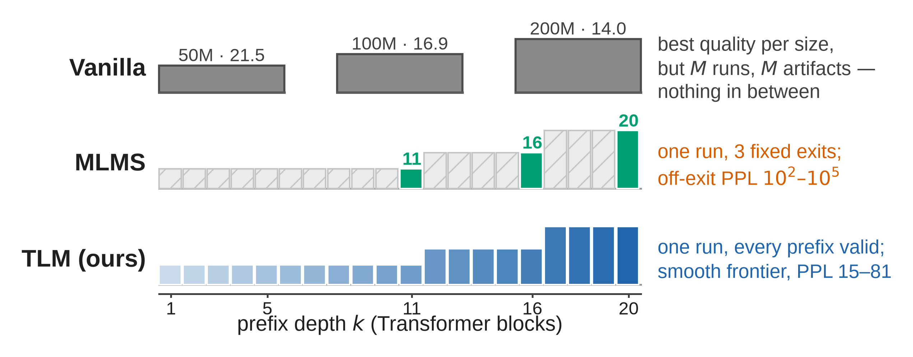

# Telescopic Language Models

*Continuous Nested Language Models via Stochastic Prefix Supervision*

[](#citation)

**[Zhilin Guo](https://zhilinguo.github.io/)¹, [Boqiao Zhang](https://boqiaoz00.github.io/boqiao_steven_zhang.github.io/)¹, [Hakan Aktas](https://scholar.google.com/citations?user=RxjN5w4AAAAJ&hl=en)¹, [Kyle Fogarty](https://kyle-fogarty.github.io/)¹, [Nursena Koprucu Aslan](https://www.cst.cam.ac.uk/people/nk618)¹, [Wenzhao Li](https://wenzhao-cam.github.io/)¹, [Canberk Baykal](https://johnberg1.github.io/)¹, [Albert Miao](https://albert-miao.github.io/)¹, [Siyu Hong](https://www.linkedin.com/in/siyuhong/)¹, Yixiao Liu², [Adam Wu](https://www.linkedin.com/in/adamtswu/)¹, [Ashish Kumar Singh](https://www.linkedin.com/in/ashish23ks)³, [Sakar Khattar](https://sakark.wixsite.com/sakark)³, [Chenliang Zhou](https://chenliang-zhou.github.io/)¹, [Weihao Xia](https://www.cst.cam.ac.uk/people/wx258)¹, [Cristina Nader Vasconcelos](https://research.google/people/106908/)³, [Cengiz Oztireli](https://sites.google.com/view/cengiz-oztireli-intro/home)¹ ³**

¹ University of Cambridge &nbsp;&nbsp;·&nbsp;&nbsp; ² University of British Columbia &nbsp;&nbsp;·&nbsp;&nbsp; ³ Google

> One deployed language model must often serve many compute budgets, yet serving each budget still means a separate training or compression run per point. We train a *Telescopic Language Model* (TLM) to be that continuum: a nested-capacity Transformer supervised by *stochastic prefix supervision with a full anchor*. At every step, one randomly truncated prefix of the capacity axis is trained against the full next-token target, alongside one full-capacity pass, so the trained artifact is a valid language model at *every* depth. Two forward-backward passes per step, no architectural change, nothing extra at inference. Fixed-exit suites such as Matryoshka Language Model Suites (MLMS) occupy one point in this design space, and the point has a cost: supervising only a few fixed exits leaves the nested model at chance level everywhere else (perplexity 10²–10⁵ in our baselines). On a 200M proxy suite (20B FineWeb-Edu tokens, identical data stream for all methods), a single TLM run is a valid language model at every one of its twenty layer prefixes, in perplexity and on perplexity-sensitive downstream tasks, reducing the area under the quality–budget curve by 43–44% relative to the fixed-exit suites while matching them at full capacity, at ~12% lower GPU cost per run. The prefix sampling density is a dial: concentrating it on a few depths recovers fixed-exit quality there at the price of the continuum, so the operating points become a training-time choice rather than an architectural one. These results indicate that the training objective, not the nesting itself, is what makes a model elastic.



**One training run, a valid language model at every depth.** *Top*: vanilla LLMs train a separate standalone model per budget (our 50M/100M/200M twins, annotated with validation perplexity) — the best quality per size, but M runs, M artifacts, and nothing in between. *Middle*: MLMS nests the budgets in one 20-layer cascade but supervises only three fixed exits (green); every other prefix is untrained and collapses (hatched). *Bottom*: a Telescopic Language Model trains one random prefix per step against the full target, so every prefix of the same cascade is a valid language model (gradient: deeper prefixes are larger models). The result is a continuum of operating points from one run, with the full-size peak close to a separately trained twin (14.99 vs. 13.98 perplexity).

## Code coming soon

We are preparing the public code release. Watch this repository for updates.

## Citation

If you use this work, please cite:

```bibtex
@article{guo2026telescopic,
  title  = {Telescopic Language Models},
  author = {Guo, Zhilin and Zhang, Boqiao and Aktas, Hakan and Fogarty, Kyle and Koprucu Aslan, Nursena and Li, Wenzhao and Baykal, Canberk and Miao, Albert and Hong, Siyu and Liu, Yixiao and Wu, Adam and Singh, Ashish Kumar and Khattar, Sakar and Zhou, Chenliang and Xia, Weihao and Vasconcelos, Cristina Nader and Oztireli, Cengiz},
  year   = {2026},
  note   = {arXiv preprint}
}
```

## License

This project is licensed under the Apache License 2.0, as found in the [LICENSE](LICENSE) file.
